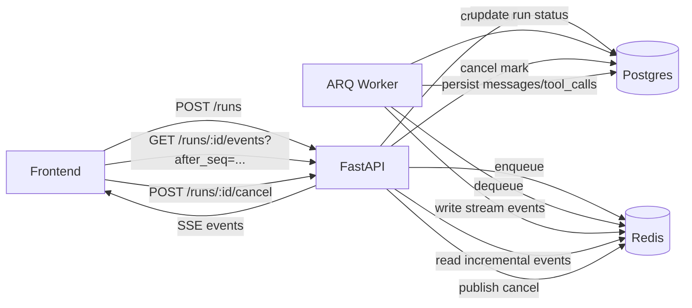
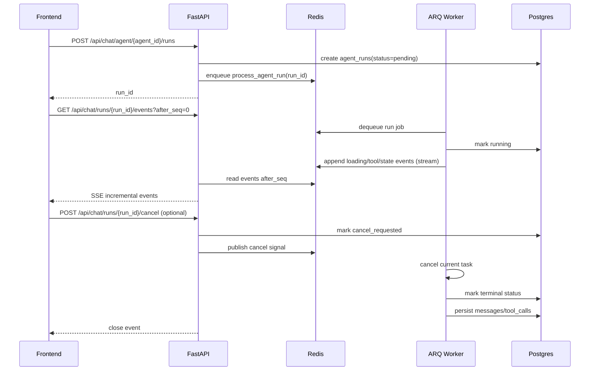

# Run 流式架构改造说明

## 1. 改造目标

本次改造将对话输出从 **HTTP 直连流** 升级为 **异步任务执行 + SSE 增量拉取**，目标是：

1. 页面离开/刷新不影响后台执行。
2. 前端支持断线重连与续流。
3. 提升系统稳定性、并发能力与可观测性。
4. 控制存储成本：过程数据短期保存，结果数据长期保存。

---

## 2. 改造前后对比（仅与 HTTP 直连流对比）

| 维度 | 改造前（HTTP 直连流） | 改造后（Run + SSE） |
|---|---|---|
| 触发方式 | `POST /agent/{id}` 后长连接直接流式输出 | `POST /runs` 创建任务，worker 异步执行 |
| 任务生命周期 | 绑定前端连接 | 与前端连接解耦 |
| 页面离开/刷新 | 常导致任务中断或前端丢上下文 | 任务继续执行，前端可续流 |
| 前端消费方式 | 同一个请求内读取 chunk | `GET /runs/{id}/events?after_seq=...` 增量拉取 |
| 恢复能力 | 弱，重连后难恢复 | 强，依赖 seq 游标恢复 |
| 取消语义 | 中断连接即可能影响任务 | 仅显式 `cancel` 才取消任务 |

---

## 3. 架构方案

### 3.1 组件职责

1. **FastAPI**：负责创建 run、查询 run、SSE 输出、cancel 接口。
2. **ARQ Worker**：负责真正执行模型流式任务。
3. **Redis**：
   - ARQ 队列
   - run 过程事件流（Redis Stream）
   - 取消信号（key + pub/sub）
4. **Postgres**：
   - run 执行状态（`agent_runs`）
   - 最终业务消息（`messages/tool_calls`）
   - checkpointer（会话运行状态）

### 3.2 架构图



---

## 4. 端到端流程（事件流转）



---

## 5. 接口与协议变更

### 5.1 对外路径（保持稳定）

1. `POST /api/chat/agent/{agent_id}/runs`
2. `GET /api/chat/runs/{run_id}`
3. `GET /api/chat/runs/{run_id}/events?after_seq=...`
4. `POST /api/chat/runs/{run_id}/cancel`

### 5.2 `after_seq` 语义

1. 主格式为字符串游标（Redis Stream ID，如 `1700000000000-3`）。
2. 兼容旧整数参数输入。
3. SSE 返回 `seq` 字段统一为字符串，前端按单调递增去重。

### 5.3 SSE 事件格式

```json
{
  "run_id": "...",
  "seq": "1700000000000-3",
  "event_type": "loading",
  "payload": {"items": [...]},
  "ts": 1700000000000
}
```

控制事件：`heartbeat` / `error` / `close`。

---

## 6. 前端行为变化

1. 本地记录活跃 run 快照：`active_run:{threadId}`。
2. 刷新/切回页面时按 `run_id + last_seq` 自动续流。
3. 接收事件先做 seq 去重，再更新 UI。
4. 保留打字机效果（`requestAnimationFrame + throttle`）。
5. 保留首条消息自动更新会话标题逻辑。

---

## 7. 稳定性设计

1. 幂等：`request_id` 避免重复创建 run。
2. 重试：仅可恢复错误触发 ARQ 重试（`max_tries=2`）。
3. 取消：DB 状态 + Redis 信号双通道。
4. SSE 生命周期：心跳、超时、终态关闭、断线重连。
5. 状态单一真相：执行态在 `agent_runs`，业务态在 `messages/tool_calls + checkpointer`。

---

## 8. 本次代码变更范围（未提交部分）

### 后端

1. `/Yuxi-Know/src/services/run_queue_service.py`
2. `/Yuxi-Know/src/services/run_worker.py`
3. `/Yuxi-Know/src/services/agent_run_service.py`
4. `/Yuxi-Know/src/repositories/agent_run_repository.py`
5. `/Yuxi-Know/server/routers/chat_router.py`
6. `/Yuxi-Know/server/worker_main.py`
7. `/Yuxi-Know/src/storage/postgres/manager.py`
8. `/Yuxi-Know/src/storage/postgres/models_business.py`

### 前端

1. `/Yuxi-Know/web/src/apis/agent_api.js`
2. `/Yuxi-Know/web/src/components/AgentChatComponent.vue`

### 测试

1. `/Yuxi-Know/test/test_run_queue_service.py`
2. `/Yuxi-Know/test/test_agent_run_service.py`
3. `/Yuxi-Know/test/test_run_worker.py`

### 配置

1. `/Yuxi-Know/docker-compose.yml`
2. `/Yuxi-Know/docker-compose.prod.yml`
3. `/Yuxi-Know/.env.template`

---

## 9. 验收标准

1. 发送消息后，SSE 能持续收到增量事件。
2. 页面刷新后，可按 `after_seq` 恢复输出。
3. 页面离开不影响后台执行。
4. 取消后 run 状态正确收敛，输出停止。
5. 最终消息与工具调用正常入库。
